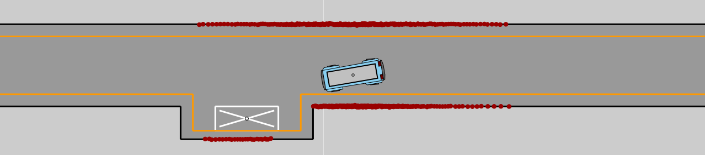

# Safe Resetless Reinforcement Learning (SRRL)

Official Implementation of our paper [Safe Resetless Reinforcement Learning: Enhancing Training Autonomy with Risk-Averse Agents](https://www.tnt.uni-hannover.de/papers/data/1746/Safe_Resetless_Reinforcement_Learning.pdf).

>Training Reinforcement Learning agents directly in any real-world environment remains difficult, as such scenarios entail the risk of damaging the training setup or violating other safety constraints. The training process itself further requires extensive human supervision and intervention to reset the environment after each episode. Thus, we propose an innovative Safe Reinforcement Learning framework that combines Safe and Resetless RL to autonomously reset environments, while also reducing the number of safety constraint violations. In this context, we develop a novel risk-averse RL agent suitable for stringent safety constraints by combining Safe RL, Distributional RL, and Randomized Ensembled Double Q-Learning. Experiments conducted in a novel mobile robotics scenario indicate that our Safe Resetless RL framework reduces the number of human interactions required during training compared to state-of-the-art methods, filling a gap in current problem formulations and enhancing the autonomy of RL training processes in real-world settings.

We evaluated our approach on a modified version of [CarEnv](https://github.com/m-schier/CarEnv) which we adapted for the mobile robotics use case by replaycing the car with a mobile robotics platform and adding a lidar as the primary sensor.



## Installation
```
cd <Path>/SRRL
sudo apt install libcairo2-dev pkg-config python3-dev
conda env create -f environment.yaml
conda activate srrl
```

## Running the experiments

### Environment config
The parameters of the simulated lidar can be configured by changing the values for ´sensors/lidar_points´ in ´envs/CarEnv/CarEnv/Configs.py´.

### Standalone agents

* __DREDQ__:
Select the default values for all algorithm parametersin `cfg/dredq.yaml` and execute
    ```
    python3 train_jax_dredq.py
    ```
* __DSAC__:
Set `update_to_data_ratio=1` and `ensemble_size=2` in `cfg/dredq.yaml` and execute
    ```
    python3 train_jax_dredq.py
    ```
* __SAC__:
Select the default values for all algorithm parameters in `cfg/sac.yaml` and execute
    ```
    python3 train_jax_sac.py
    ```
* __REDQ__:
Set `update_to_data_ratio=10` and `ensemble_size=10` in `cfg/sac.yaml` and execute
    ```
    python3 train_jax_sac.py
    ```
* __WCSAC__:
Select the default values for all algorithm parameters in `cfg/wcsac.yaml` and execute
    ```
    python3 train_jax_wcsac.py
    ```
* __Example-based SAC__:
Select the default values for all algorithm parameters in `cfg/example_based_sac.yaml` and execute
    ```
    python3 train_jax_example_based_sac.py
    ```
### Safe Resetless RL framework
Select a forward and a reset agent and their respective parameters in `cfg/srrl.yaml` and execute
```
python3 train_jax_srrl.py
```

Please note that we have used [W&B](https://wandb.ai/) for logging, so you may require an account to log output without modifications to the code.


## Citing

Please cite this work as:

```bibtex
@inproceedings { GotSch2024,
  author = {Tristan Gottwald and Maximilian Schier and Bodo Rosenhahn},
  title = {Safe Resetless Reinforcement Learning: Enhancing Training Autonomy with Risk-Averse Agents},
  booktitle = {European Conference on Computer Vision Workshops (ECCVW)},
  year = {2024},
  month = oct
}
```
